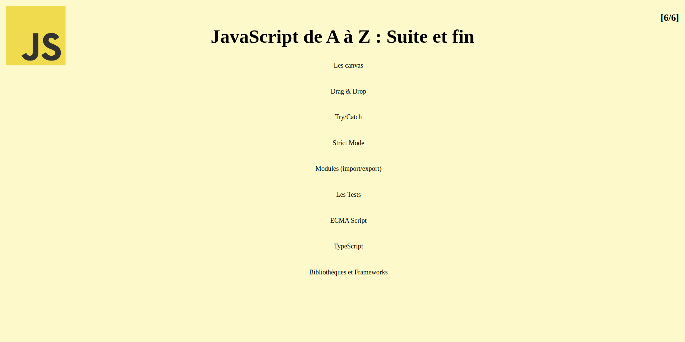

# -Cours-Javascript-Apprendre-Javascript-de-A-Z-La-POO-5-6-
From Scratch - Développement Web

## From Scratch - Développement Web

( [VIDEO](https://youtu.be/KlbjPaRwzB0) )

**Timecodes**

- [x] 0:00 - Intro
- [x] 4:14 - Canvas
- [x] 37:50 - Drag & Drop
- [x] 49:44 - Try / Catch
- [x] 1:00:11 - Strict Mode
- [x] 1:03:51 - Modules (Import & export)
- [x] 1:13:39 - Les tests
- [x] 1:31:24 - ECMA Script
- [x] 1:40:06 - TypeScript
- [x] 1:44:06 - Les bibliothèques JS
- [x] 1:47:48 - Comparatif des Frameworks JS

